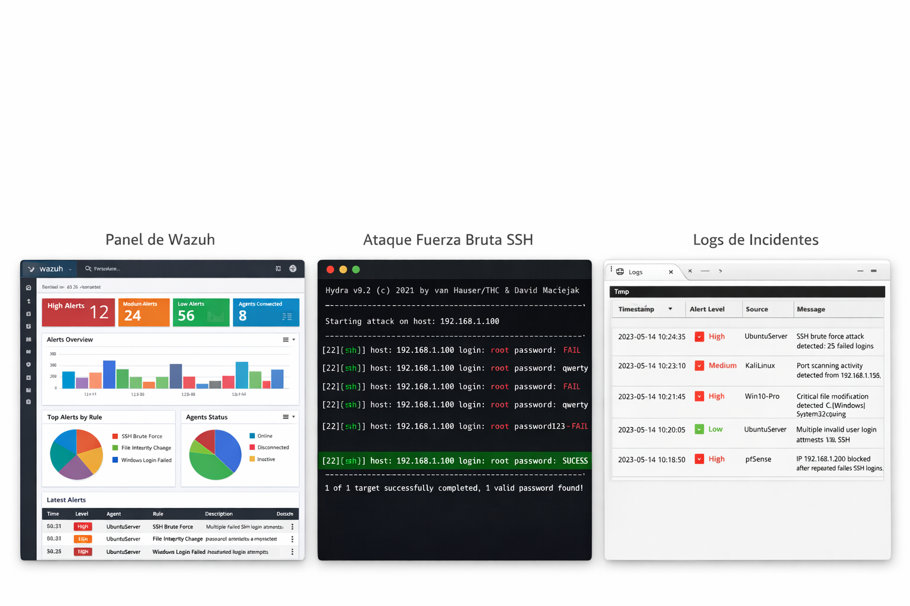

🛡️ Cybersecurity Blue Team Lab

Simulación de un entorno empresarial orientado a la detección y respuesta ante incidentes de ciberseguridad (Blue Team) mediante SIEM, firewalling y segmentación de red.
---

## 🎯 Objetivo

Diseñar un laboratorio de ciberseguridad capaz de simular un entorno empresarial y detectar amenazas en tiempo real mediante herramientas SIEM y control de red.

---

## 🏗️ Arquitectura

- Firewall: pfSense  
- SIEM: Wazuh  
- Sistemas:
  - Ubuntu Server (hardenizado)
  - Windows 10  
- Virtualización: Proxmox / VirtualBox  

---

## ⚔️ Escenarios simulados

- Ataques de fuerza bruta SSH  
- Escaneo de red  
- Monitorización de integridad de archivos (FIM)  

---

## 🕵️ Escenario destacado

**Ataque:** Fuerza bruta SSH  
**Herramienta:** Hydra  
**Detección:** Alertas en Wazuh  
**Respuesta:** Bloqueo de IP mediante pfSense  

---

## 📊 Resultados

- Detección en tiempo real de amenazas  
- Correlación de eventos en el SIEM  
- Aplicación de medidas de mitigación  

---

## 📸 Evidencias

---

## 🚀 Portfolio

https://pablito05090509.github.io/cybersecurity-portfolio
